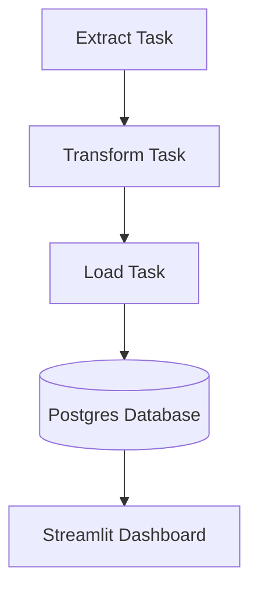

# COVID-19 ETL Pipeline with Airflow & Streamlit

This project demonstrates the full lifecycle of a data engineering pipeline—extracting historical COVID‑19 data via a public API, transforming it with rolling averages, and loading it into a managed PostgreSQL database—using Apache Airflow for orchestration and Streamlit for interactive visualization. Built as a hands‑on learning exercise to master ETL best practices, Docker Compose deployment, configuration management, and modern data‑quality checks.

**Author:** Nihar SANTOKI (LinkedIn: [https://www.linkedin.com/in/nihar-santoki](https://www.linkedin.com/in/nihar-santoki), Email: [nihar.santoki@gmail.com](mailto:nihar.santoki@gmail.com))

---

## 🚀 Quick Start

### Prerequisites

* Docker & Docker Compose
* A PostgreSQL database (e.g., hosted on AlwaysData)
* (Optional) TEST\_MODE for local CSV testing

### Clone & Configure

```bash
# Clone the repository
git clone https://github.com/Nihar-SANTOKI/covid-etl-pipeline.git
cd covid-etl-pipeline

# Copy and fill in your environment variables
cp .env.sample .env
# Edit .env to include DB_HOST, DB_PORT, DB_NAME, DB_USER, DB_PASS

# Launch the containers
docker-compose up -d --build
```

### Access UIs

* **Airflow:** [http://localhost:8080](http://localhost:8080)
* **Streamlit Dashboard:** [http://localhost:8501](http://localhost:8501)

---

## 📂 Repo Structure

```
.
├─ config/
│   └─ config.yaml
├─ dags/
│   ├─ etl/
│   │   ├─ __init__.py
│   │   ├─ extract.py
│   │   ├─ transform.py
│   │   └─ load.py
│   └─ covid_etl_pipeline.py
├─ dashboard/
│   ├─ sample_data.csv
│   └─ streamlit_app.py
├─ docker-compose.yml
├─ .env
├─ .env.sample
├─ .gitignore
└─ README.md
```

---

## 📊 Architecture Diagram



---

## ⚙️ Configuration

### Database Schema

The pipeline writes to a single table, **`covid_history`**, with the following structure:

```sql
-- Drop if it already exists (safe to run)
DROP TABLE IF EXISTS covid_history;

-- Create the table
CREATE TABLE covid_history (
  date            DATE               NOT NULL,
  country         TEXT               NOT NULL,
  cases           INTEGER,
  deaths          INTEGER,
  recovered       INTEGER,
  new_cases       INTEGER,
  new_deaths      INTEGER,
  new_recovered   INTEGER,
  avg7_new_cases  DOUBLE PRECISION,
  avg7_new_deaths DOUBLE PRECISION,
  avg7_new_recovered DOUBLE PRECISION,
  PRIMARY KEY (date, country)
);
```

### `config/config.yaml`

```yaml
database:
  host:              # e.g. your_host.alwaysdata.net
  port: 5432
  database:          # your database name
  user:              # your database user
  password:          # your database password

covid_api:
  base_url: "https://disease.sh/v3/covid-19"
  historical_country: "/historical/{country}?lastdays={days}"

pipeline:
  countries: ["USA", "India", "Brazil", "France"]
  days: 365
  rolling_window: 7
```

### Environment Variables (`.env`)

The file `.env` (not committed) overrides these settings:

```env
DB_HOST=your_db_host
DB_PORT=5432
DB_NAME=your_db_name
DB_USER=your_db_user
DB_PASS=your_db_password
DB_CONN=postgresql+psycopg2://${DB_USER}:${DB_PASS}@${DB_HOST}:${DB_PORT}/${DB_NAME}
```

---

## 🧪 Test Mode

If you don’t have a live database or want to preview the dashboard quickly, run in test mode:

```bash
# Use the sample CSV instead of querying the database
export TEST_MODE=true
streamlit run dashboard/streamlit_app.py
```

Or with Docker Compose:

```bash
docker-compose run -e TEST_MODE=true streamlit
```

This will load `dashboard/sample_data.csv` for display.

---

## 🔗 Links

* **GitHub Repository:** [https://github.com/Nihar-SANTOKI/covid-etl-pipeline](https://github.com/Nihar-SANTOKI/covid-etl-pipeline)

---

## ✍️ Author & Contact

**Nihar SANTOKI**
LinkedIn: [https://www.linkedin.com/in/nihar-santoki](https://www.linkedin.com/in/nihar-santoki)
Email: [nihar.santoki@gmail.com](nihar.santoki@gmail.com)
